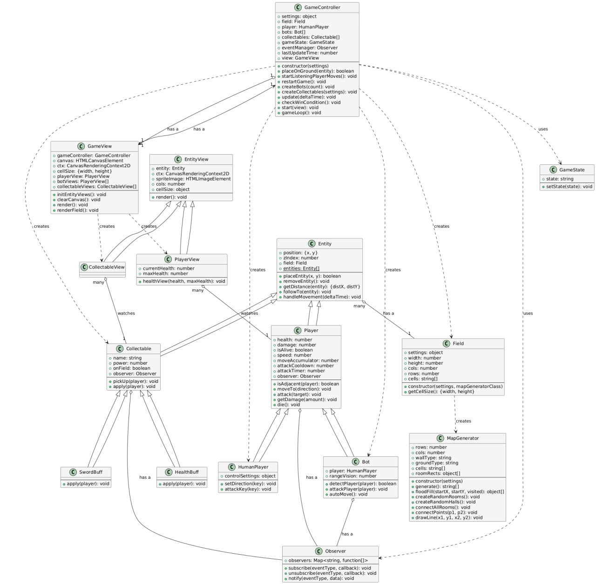

### README.md

# Рогалик 2D

Этот проект представляет собой простую 2D игру, разработанную на чистом JavaScript. В основе архитектуры лежат популярные паттерны проектирования **Observer** и **Model-View-Controller (MVC)**, которые обеспечивают гибкость, масштабируемость и четкое разделение обязанностей между компонентами.

## Обзор архитектуры

Проект структурирован в соответствии с принципами MVC:

  * **Model**: Содержит всю игровую логику и данные. Сюда входят классы, описывающие игровое поле (`Field`), персонажей (`Player`, `Bot`), предметы (`Collectable`) и их взаимодействие.
  * **View**: Отвечает за отрисовку всех игровых элементов на canvas. Классы `GameView`, `PlayerView` и `CollectableView` берут данные из модели и визуализируют их, не содержа при этом никакой игровой логики.
  * **Controller**: Выступает в роли связующего звена. Класс `GameController` обрабатывает ввод пользователя, управляет игровым циклом и координирует взаимодействие между моделью и представлением.

Помимо MVC, активно используется паттерн **Observer** (Наблюдатель). Этот паттерн позволяет объектам (наблюдателям) подписываться на события других объектов (издателей) и получать уведомления при их возникновении. В нашем случае:

  * Класс `Observer` позволяет сущностям (например, `Player`, `Bot`, `Collectable`) оповещать подписчиков о событиях, таких как получение урона (`getDamage`), смерть (`die`) или подбор предмета (`pickedUp`).
  * Представления (`PlayerView`, `CollectableView`) подписываются на соответствующие события модели, чтобы автоматически обновлять свой внешний вид, когда состояние меняется, например, при изменении здоровья или подборе предмета.

## Объект настроек

Все ключевые параметры игры можно настроить в объекте `settings` в файле `main.js`. Вы можете изменить следующие параметры:

**Настройки карты (`map`):**

  * `field.cols` и `field.rows`: Ширина и высота игрового поля в ячейках.
  * `obstacles.rooms.range`: Минимальное и максимальное количество комнат.
  * `obstacles.rooms.size`: Минимальный и максимальный размер комнат.
  * `obstacles.halls.range`: Минимальное и максимальное количество коридоров.
  * `obstacles.halls.size`: Минимальный и максимальный размер коридоров.

**Настройки игрока (`player`):**

  * `health`: Начальное здоровье игрока.
  * `damage`: Начальный урон.
  * `attackCooldown`: Время в секундах между атаками.
  * `speed`: Скорость движения игрока (количество клеток в секунду).
  * `controls.attack`: Клавиша для атаки (по умолчанию — `Space`).

**Настройки ботов (`bots`):**

  * `amount`: Количество ботов на карте.
  * `health`: Здоровье каждого бота.
  * `damage`: Урон, наносимый ботом.
  * `rangeVision`: Радиус, в пределах которого бот будет следовать за игроком.
  * `speed`: Скорость движения ботов.
  * `attackCooldown`: Время в секундах между атаками ботов.

**Настройки коллекционных предметов (`collectables`):**

  * `healthPotion.amount`: Количество зелий здоровья на карте.
  * `healthPotion.power`: Количество здоровья, восстанавливаемое зельем.
  * `sword.amount`: Количество мечей.
  * `sword.power`: Дополнительный урон, получаемый при подборе меча.

## Как играть?

**Управление:**

  * **Движение:** Используйте клавиши **WASD** или **стрелки**.
  * **Атака:** Нажмите клавишу **Пробел** (по умолчанию), чтобы атаковать врагов в соседних клетках.

## Запуск

Вы можете скачать проект архивом и запустить файл `index.html` в любом современном браузере. Кроме того, вы можете [сыграть в игру онлайн](https://mkprkk.github.io/rogue/).

### Диаграмма классов (UML)

